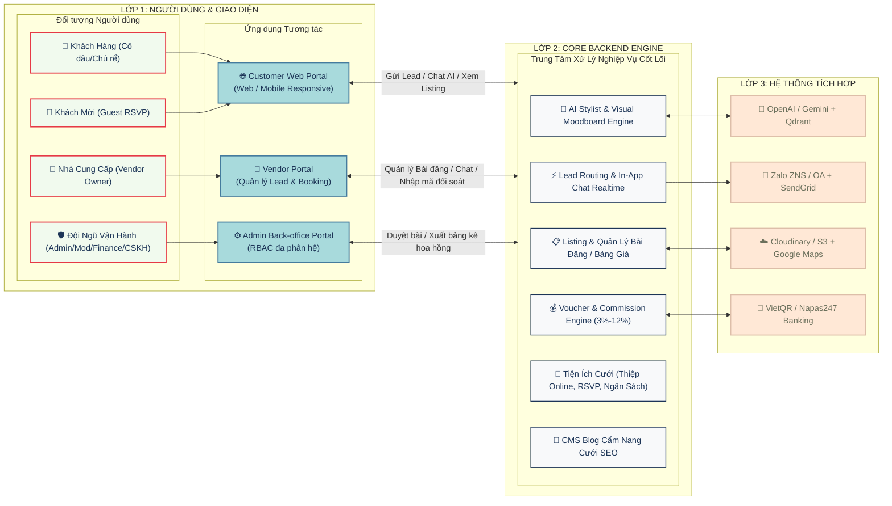

# TỔNG QUAN SẢN PHẨM: NỀN TẢNG DỊCH VỤ CƯỚI (WEDDING SERVICE PLATFORM)

---

## 1. ĐỐI TƯỢNG SỬ DỤNG & ỨNG DỤNG TƯƠNG TÁC (ACTORS & APPS)

Áp dụng mô hình **Lean MVP** tinh gọn, cắt bỏ hoàn toàn các phân quyền nhân sự/timeline rườm rà, tập trung 100% vào giá trị kết nối và sinh lời:

| Đối tượng (User/Actor) | Phân loại | Ứng dụng Tương tác (App/Interface) | Mục đích sử dụng chính (Mapping Input / Output) |
| :--- | :--- | :--- | :--- |
| **Cô dâu / Chú rể (Khách hàng)** | End-User (Bên Cầu) | **Customer Web Portal** *(Web / Mobile Responsive)* | • **Khám phá:** Lướt danh mục dịch vụ, xem album ảnh portfolio, bảng giá niêm yết và đánh giá thực tế. • **Tương tác AI:** Chat với AI Stylist & làm trắc nghiệm hình ảnh (Visual Moodboard) để nhận gợi ý 3-5 NCC chuẩn gu và ngân sách. • **Gửi & Quản lý Lead:** Gửi yêu cầu tư vấn (SĐT được bảo mật ẩn ban đầu), nhận mã ưu đãi độc quyền (Voucher Code) và theo dõi trạng thái tư vấn. • **Giao tiếp:** Chat trực tiếp In-App hoặc kết nối Zalo với NCC. • **Tiện ích cưới:** Tạo thiệp online mẫu chuẩn, nhận phản hồi RSVP từ khách mời, quản lý ngân sách và checklist 12 tháng. • **Xác thực:** Nhận thông báo xác nhận hợp đồng (Two-way confirmation) và nhận quà mừng cưới từ Sàn. |
| **Khách mời (Wedding Guests)** | End-User (Khách mời) | **Customer Web Portal - RSVP Page** *(Web link / QR)* | Mở link thiệp cưới xem ảnh, bản đồ chỉ đường Google Maps tới sảnh tiệc và bấm xác nhận tham dự (RSVP) 1 chạm không cần tài khoản. |
| **Nhà Cung Cấp (NCC / Vendor Owner)** | Partner B2B (Bên Cung) | **Vendor Portal** *(Web Portal Tinh Gọn)* | • **Quản lý Bài đăng:** Soạn, sửa và nộp bài đăng dịch vụ/gói giá kèm ảnh portfolio lên kiểm duyệt; quản lý danh sách bài đăng đã duyệt. • **Tiếp nhận Lead & Chat:** Nhận thông báo lead tức thì qua Zalo/In-App (<10s), mở phòng chat trực tiếp tư vấn và gửi báo giá cho khách. • **Xác nhận Hợp đồng:** Nhập mã ưu đãi + giá trị hợp đồng thực tế sau khi chốt khách thành công để kích hoạt xác thực 2 chiều. • **Báo cáo & Đối soát:** Xem thống kê lượt xem bài đăng, số lượng lead nhận được; xem bảng kê hoa hồng tháng (ngày 25) và trả lời đánh giá review của khách. |
| **Kiểm duyệt viên (Moderator)** | Internal Ops (Nội bộ) | **Admin Back-office Portal** *(RBAC: Moderator)* | Thẩm định hồ sơ đối tác NCC, kiểm duyệt bài đăng dịch vụ (SLA 24h), duyệt review và biên tập bài viết Cẩm nang cưới SEO. |
| **Kế toán / Đối soát (Finance)** | Internal Ops (Nội bộ) | **Admin Back-office Portal** *(RBAC: Finance)* | Quản lý hợp đồng đối tác, đối soát hoa hồng 3%-12% (chia 2 kỳ: lúc cọc và sau cưới), theo dõi thanh toán VietQR và xuất hóa đơn VAT. |
| **Chăm sóc Khách hàng (CSKH)** | Internal Ops (Nội bộ) | **Admin Back-office Portal** *(RBAC: Customer Care)* | Hỗ trợ người dùng, giải quyết khiếu nại, audit chất lượng lead và kích hoạt khớp nối khẩn cấp (Emergency Matching) khi có sự cố. |
| **Quản trị viên Cấp cao (Super Admin)** | Internal Ops (Nội bộ) | **Admin Back-office Portal** *(RBAC: Super Admin)* | Cấu hình tham số tỷ lệ hoa hồng, quản trị cây danh mục dịch vụ cưới và xem báo cáo tổng thể toàn sàn. |

---

## 2. HỆ THỐNG TÍCH HỢP BÊN NGOÀI (EXTERNAL SYSTEMS)

| Nhóm Hệ Thống | Đối Tác / Dịch Vụ Tích Hợp | Mục Đích Tích Hợp |
| :--- | :--- | :--- |
| **1. Trợ Lý AI & Vector DB** | **OpenAI / Gemini / Claude API + Qdrant Vector DB** | Bóc tách gu cưới/ngân sách từ lời nhắn tự nhiên và semantic matching 3-5 NCC tối ưu. |
| **2. Thông Báo & Tin Nhắn** | **Zalo ZNS / Zalo OA API + SendGrid Email** | Bắn tin nhắn thông báo lead mới trong 10s tới NCC, gửi OTP và thông báo đối soát 2 chiều. |
| **3. Lưu Trữ Media & Bản Đồ** | **Cloudinary / AWS S3 + Google Maps Platform** | Lưu trữ nén ảnh portfolio chất lượng cao và định vị vị trí sảnh tiệc trên bản đồ. |
| **4. Đối Soát Ngân Hàng** | **VietQR / Napas247 Banking** | Tự động sinh mã QR thanh toán hoa hồng và webhook gạch nợ tự động. |

---

## 3. SƠ ĐỒ BỐI CẢNH SẢN PHẨM (SYSTEM CONTEXT DIAGRAM)

