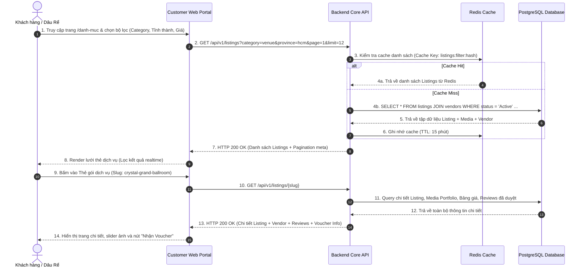
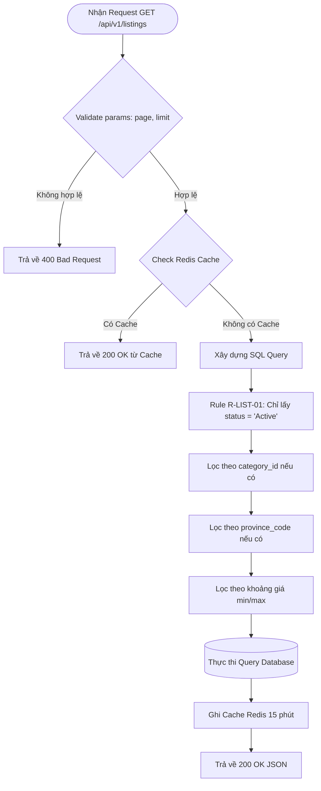

# SEQUENCE DIAGRAM & ĐẶC TẢ API (TECHNICAL SPECIFICATION)
## DỰ ÁN: NỀN TẢNG MÔI GIỚI DỊCH VỤ CƯỚI (WEDDING SERVICE PLATFORM)
### MODULE: KHÁM PHÁ DANH MỤC & XEM CHI TIẾT BÀI ĐĂNG (UC 1.1 & 1.2)

---

## 1. Sơ Đồ Trình Tự Tương Tác (Sequence Diagram)



---

## 2. Bảng Danh Sách API Liên Quan

| STT | Mã BA ID | HTTP Method | Endpoint URL | Tên Nghiệp Vụ / Chức Năng | Màn Hình Gọi |
|:---|:---|:---|:---|:---|:---|
| 1 | `API-LISTING-01` | `GET` | `/api/v1/categories` | Lấy danh sách 7 danh mục dịch vụ cưới | `SCR-BROWSE-LISTING` |
| 2 | `API-LISTING-02` | `GET` | `/api/v1/listings` | Tìm kiếm, lọc và phân trang bài đăng dịch vụ | `SCR-BROWSE-LISTING` |
| 3 | `API-LISTING-03` | `GET` | `/api/v1/listings/{slug}` | Xem chi tiết gói dịch vụ và portfolio ảnh/video | `SCR-LISTING-DETAIL` |

---

## 3. Đặc Tả Chi Tiết Từng API

### 3.1. `API-LISTING-02`: Lấy danh sách bài đăng có bộ lọc (GET `/api/v1/listings`)

#### Request Parameters (Query String):
| Tham Số | Kiểu Dữ Liệu | Bắt Buộc | Mặc Định | Mô Tả |
|:---|:---|:---|:---|:---|
| `category` | String | Không | `null` | Mã code hoặc ID danh mục (vd: `venue`, `decor`, `photo`) |
| `province` | String | Không | `null` | Mã tỉnh thành (vd: `hcm`, `hn`, `dn`) |
| `price_min` | Number | Không | `0` | Giá tối thiểu (VNĐ) |
| `price_max` | Number | Không | `null` | Giá tối đa (VNĐ) |
| `rating_min`| Float | Không | `null` | Số sao tối thiểu (vd: `4.5`, `4.8`) |
| `style` | String | Không | `null` | Phong cách cưới (vd: `minimalist`, `vintage`) |
| `has_voucher`| Boolean | Không | `false` | Chỉ lấy bài đăng có ưu đãi Voucher |
| `sort_by` | String | Không | `recommended`| `recommended`, `price_asc`, `price_desc`, `rating` |
| `page` | Integer | Không | `1` | Số thứ tự trang |
| `limit` | Integer | Không | `12` | Số lượng bài đăng trên mỗi trang |

#### Response Success (`HTTP 200 OK`):
```json
{
  "success": true,
  "data": {
    "items": [
      {
        "id": "c1f7a28e-5b12-4c28-97e3-0d5b1234abcd",
        "slug": "crystal-grand-ballroom-reverie",
        "title": "Gói Sảnh Tiệc Pha Lê Hoàng Gia (Crystal Grand Ballroom)",
        "category": {
          "id": "cat-01",
          "code": "venue",
          "name": "Trung tâm Tiệc cưới"
        },
        "vendor": {
          "id": "ven-01",
          "brand_name": "The Reverie Saigon Hall",
          "is_verified": true,
          "province_code": "hcm",
          "district": "Quận 1"
        },
        "price_min": 12500000,
        "price_max": 25000000,
        "price_unit": "bàn",
        "rating_avg": 4.9,
        "review_count": 48,
        "cover_image_url": "https://images.unsplash.com/photo-1519167758481-83f550bb49b3",
        "voucher_tag": "Giảm 5% + Tặng Bàn Gallery",
        "style_tags": ["vintage", "luxury", "royal"]
      }
    ],
    "pagination": {
      "total_items": 42,
      "total_pages": 4,
      "current_page": 1,
      "limit": 12
    }
  }
}
```

#### Response Errors:
* `HTTP 400 Bad Request`: Tham số `page` hoặc `limit` không hợp lệ (`page < 1`).
* `HTTP 500 Internal Server Error`: Lỗi kết nối CSDL hoặc Redis.

---

### 3.2. `API-LISTING-03`: Xem chi tiết gói dịch vụ (GET `/api/v1/listings/{slug}`)

#### Response Success (`HTTP 200 OK`):
```json
{
  "success": true,
  "data": {
    "id": "c1f7a28e-5b12-4c28-97e3-0d5b1234abcd",
    "slug": "crystal-grand-ballroom-reverie",
    "title": "Gói Sảnh Tiệc Pha Lê Hoàng Gia (Crystal Grand Ballroom)",
    "description": "Sảnh tiệc pha lê phong cách hoàng gia Châu Âu với sức chứa lên tới 600 khách...",
    "category": { "code": "venue", "name": "Trung tâm Tiệc cưới" },
    "vendor": {
      "id": "ven-01",
      "brand_name": "The Reverie Saigon Hall",
      "hotline": "0909123456",
      "address_detail": "22-36 Nguyễn Huệ, Phường Bến Nghé, Quận 1, TP.HCM",
      "rating_avg": 4.9,
      "is_verified": true
    },
    "price_min": 12500000,
    "price_max": 25000000,
    "media_portfolio": [
      { "media_url": "https://images.unsplash.com/photo-1519167758481-83f550bb49b3", "media_type": "IMAGE", "is_cover": true },
      { "media_url": "https://images.unsplash.com/photo-1511795409834-ef04bbd61622", "media_type": "IMAGE", "is_cover": false }
    ],
    "active_voucher": {
      "code_prefix": "WVIP",
      "discount_description": "Tặng voucher giảm 5% trên tổng giá trị hợp đồng khi đặt cọc qua Sàn"
    },
    "recent_reviews": [
      {
        "author_name": "Minh & Hằng",
        "rating": 5,
        "comment": "Sảnh đẹp lộng lẫy, âm thanh ánh sáng chuẩn 5 sao. Được Sàn tặng voucher tiết kiệm được gần 20 triệu!",
        "is_verified_buyer": true,
        "created_at": "2026-09-15"
      }
    ]
  }
}
```

---

## 4. Quy Tắc Xử Lý Backend & Activity Rules

### Luồng xử lý BE & Rule cho `GET /api/v1/listings`:



| Mã Rule | Tên Quy Tắc | Nội Dung & Điều Kiện Thực Thi | Hành Động Khi Vi Phạm |
|:---|:---|:---|:---|
| **R-LIST-01** | Chỉ hiển thị bài đăng Active | Mọi truy vấn công khai của khách hàng chỉ được phép lấy các bài đăng có `Listing.status = 'Active'` và `Vendor.status = 'Active'`. | Bài đăng đang duyệt `PendingModeration` hoặc bị ẩn `Hidden` tuyệt đối không xuất hiện trong kết quả |
| **R-LIST-02** | Giới hạn phân trang an toàn | Tham số `limit` tối đa không vượt quá `50` bài đăng/request để bảo vệ tài nguyên server. | Nếu `limit > 50`, hệ thống tự ép về `limit = 50` |
