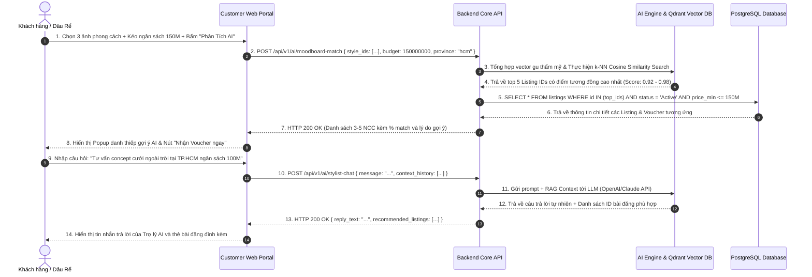

# SEQUENCE DIAGRAM & ĐẶC TẢ API (TECHNICAL SPECIFICATION)
## DỰ ÁN: NỀN TẢNG MÔI GIỚI DỊCH VỤ CƯỚI (WEDDING SERVICE PLATFORM)
### MODULE: AI MOODBOARD QUIZ & AI STYLIST CHAT (UC 1.3 & 1.4)

---

## 1. Sơ Đồ Trình Tự Tương Tác (Sequence Diagram)



---

## 2. Bảng Danh Sách API Liên Quan

| STT | Mã BA ID | HTTP Method | Endpoint URL | Tên Nghiệp Vụ / Chức Năng | Màn Hình Gọi |
|:---|:---|:---|:---|:---|:---|
| 1 | `API-AI-01` | `POST` | `/api/v1/ai/moodboard-match` | Khớp nối gợi ý 3-5 NCC từ kết quả Moodboard & Ngân sách | `SCR-AI-STYLIST` |
| 2 | `API-AI-02` | `POST` | `/api/v1/ai/stylist-chat` | Trò chuyện, tư vấn ý tưởng và giải đáp thắc mắc cưới cùng AI Stylist | `SCR-AI-STYLIST` |

---

## 3. Đặc Tả Chi Tiết API

### 3.1. `API-AI-01`: Khớp nối gợi ý AI Moodboard (POST `/api/v1/ai/moodboard-match`)

#### Request Body (JSON):
```json
{
  "selected_style_ids": ["style_royal_01", "style_garden_02", "style_outdoor_03"],
  "budget_expected": 150000000,
  "province_code": "hcm",
  "category_priorities": ["venue", "decor", "photo"]
}
```

#### Response Success (`HTTP 200 OK`):
```json
{
  "success": true,
  "data": {
    "summary_aesthetic": "Phong cách Lãng Mạn Cổ Điển kết hợp Không Gian Xanh Ngoài Trời (Romantic Classical Garden)",
    "recommendations": [
      {
        "listing_id": "c1f7a28e-5b12-4c28-97e3-0d5b1234abcd",
        "vendor_name": "The Reverie Saigon Hall",
        "title": "Gói Sảnh Tiệc Pha Lê Hoàng Gia (Crystal Grand Ballroom)",
        "match_score": 98,
        "match_reason": "Tone màu vàng kim và kiến trúc vòm kính hoàn toàn trùng khớp với 2/3 ảnh phong cách bạn chọn.",
        "price_range": "12.500.000đ - 25.000.000đ / bàn",
        "cover_image_url": "https://images.unsplash.com/photo-1519167758481-83f550bb49b3",
        "voucher_code": "WVIP8899",
        "discount_highlight": "Tặng voucher giảm 5% khi gửi yêu cầu ngay"
      },
      {
        "listing_id": "e8b2c41a-9f33-4a11-85b2-3e7c9876efgh",
        "vendor_name": "Bliss Wedding Decor",
        "title": "Gói Trang Trí Concept Vườn Cổ Tích (Secret Garden Floral)",
        "match_score": 95,
        "match_reason": "Hạng mục decor chuyên biệt về hoa tươi ngoài trời, tối ưu trong khoảng ngân sách dưới 50 triệu.",
        "price_range": "35.000.000đ - 45.000.000đ",
        "cover_image_url": "https://images.unsplash.com/photo-1511795409834-ef04bbd61622",
        "voucher_code": "WVIP7722",
        "discount_highlight": "Voucher giảm 2.000.000đ trực tiếp vào hợp đồng"
      }
    ]
  }
}
```

#### Response Errors:
* `HTTP 400 Bad Request`: `selected_style_ids` không đủ 3 ảnh hoặc `budget_expected <= 0`.
* `HTTP 504 Gateway Timeout`: Dịch vụ Vector DB / LLM phản hồi chậm quá 5 giây.

---

## 4. Quy Tắc Xử Lý Backend & Activity Rules

| Mã Rule | Tên Quy Tắc | Nội Dung & Điều Kiện Thực Thi |
|:---|:---|:---|
| **R-AI-01** | Bắt buộc chọn đúng 3 ảnh Moodboard | Hệ thống chỉ kích hoạt thuật toán tổng hợp Vector khi người dùng chọn đúng 3 bức ảnh đại diện phong cách để đảm bảo độ chính xác của hồ sơ thẩm mỹ. |
| **R-AI-02** | Ràng buộc ngân sách và trạng thái | Các bài đăng được AI gợi ý bắt buộc phải có `status = 'Active'` và giá sàn `price_min <= budget_expected * 1.2` (cho phép dung sai tối đa 20% ngân sách). |
