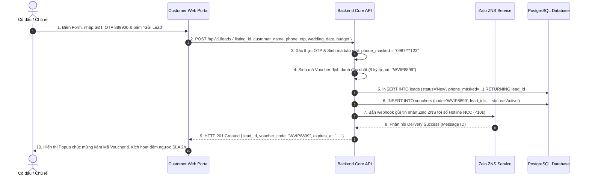

# SEQUENCE DIAGRAM & ĐẶC TẢ API (TECHNICAL SPECIFICATION)
## MODULE: GỬI YÊU CẦU TƯ VẤN & CẤP MÃ VOUCHER (UC 2.1)

---

## 1. Sơ Đồ Trình Tự Tương Tác (Sequence Diagram)



---

## 2. Đặc Tả Chi Tiết API: `POST /api/v1/leads`

#### Request Headers:
* `Content-Type`: `application/json`
* `X-Client-Session`: UUID định danh phiên trình duyệt (nếu khách vãng lai chưa đăng nhập).

#### Request Body (JSON):
```json
{
  "listing_id": "c1f7a28e-5b12-4c28-97e3-0d5b1234abcd",
  "customer_name": "Quốc Bảo & Mai Anh",
  "phone": "0988665544",
  "otp_code": "889900",
  "wedding_date": "2026-12-20",
  "budget_expected": 180000000,
  "guest_count_expected": 350,
  "note": "Cần tư vấn sảnh tiệc tối có không gian đón khách ngoài trời"
}
```

#### Response Success (`HTTP 201 Created`):
```json
{
  "success": true,
  "data": {
    "lead_id": "lead-9988-7766-5544",
    "status": "New",
    "phone_masked": "0988***544",
    "voucher": {
      "code": "WVIP8899",
      "status": "Active",
      "discount_description": "Ưu đãi giảm 5% trên tổng giá trị hợp đồng dịch vụ cưới",
      "expires_at": "2026-10-27T23:59:59Z"
    },
    "vendor_sla": {
      "max_response_time": "2 hours",
      "deadline": "2026-09-27T15:25:00Z"
    }
  }
}
```

#### Response Errors:
* `HTTP 400 Bad Request`: Mã OTP sai hoặc hết hạn (`ERR_INVALID_OTP`).
* `HTTP 422 Unprocessable Entity`: Ngày cưới trong quá khứ (`ERR_INVALID_WEDDING_DATE`).

---

## 3. Quy Tắc Xử Lý Backend & Activity Rules

| Mã Rule | Tên Quy Tắc | Nội Dung Chi Tiết |
|:---|:---|:---|
| **R-LEAD-01** | Mã hóa SĐT Smart Privacy | Backend bắt buộc phải tạo trường `phone_masked` dạng `0988***544` khi lưu vào database. Trong response gửi sang Vendor ban đầu, tuyệt đối không lộ SĐT đầy đủ cho đến khi khách đồng ý (`BR-002`). |
| **R-LEAD-02** | Khóa thời hạn Voucher 30 ngày | Thuộc tính `expires_at` của Voucher luôn được tính bằng `created_at + 30 days` (`BR-004`). |
