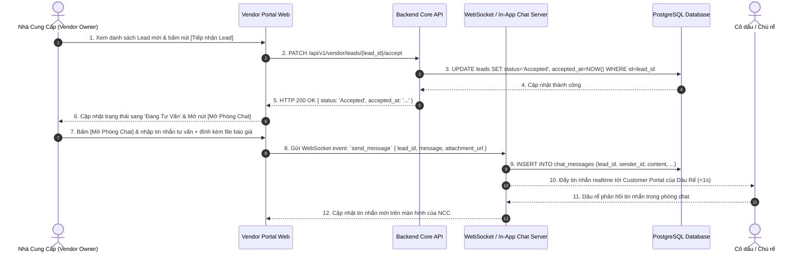

# SEQUENCE DIAGRAM & ĐẶC TẢ API (TECHNICAL SPECIFICATION)
## MODULE: TIẾP NHẬN LEAD & CHAT BÁO GIÁ CỦA NCC (UC 2.3 & 2.4)

---

## 1. Sơ Đồ Trình Tự Tương Tác (Sequence Diagram)



---

## 2. Đặc Tả Chi Tiết API

### 2.1. `API-LEAD-03`: Tiếp nhận Lead (PATCH `/api/v1/vendor/leads/{lead_id}/accept`)
#### Request Headers:
* `Authorization`: `Bearer <vendor_jwt_token>`
#### Response Success (`HTTP 200 OK`):
```json
{
  "success": true,
  "data": {
    "lead_id": "lead-9988-7766-5544",
    "status": "Accepted",
    "accepted_at": "2026-09-27T13:30:00Z",
    "sla_performance": "Met SLA (Response time: 15 minutes)"
  }
}
```

### 2.2. `API-CHAT-01`: Lấy lịch sử chat (GET `/api/v1/leads/{lead_id}/messages`)
#### Response Success (`HTTP 200 OK`):
```json
{
  "success": true,
  "data": {
    "lead_id": "lead-9988-7766-5544",
    "messages": [
      {
        "id": "msg-001",
        "sender_role": "CLIENT",
        "sender_name": "Quốc Bảo & Mai Anh",
        "content": "Chào bên The Reverie Saigon, mình nhận được mã Voucher WVIP8899...",
        "created_at": "2026-09-27T13:28:00Z"
      },
      {
        "id": "msg-002",
        "sender_role": "VENDOR",
        "sender_name": "The Reverie Saigon",
        "content": "Dạ em chào anh chị! Em gửi anh chị file PDF thực đơn mẫu ạ...",
        "attachment_url": "https://cdn.weddingplat.vn/quotes/menu-reverie-2026.pdf",
        "created_at": "2026-09-27T13:32:00Z"
      }
    ]
  }
}
```

---

## 3. Quy Tắc Xử Lý Backend & Activity Rules

* **`R-LEAD-03` (Quyền truy cập phòng chat):** Chỉ có Chủ Nhà cung cấp được gán cho Lead đó (`vendor_id = current_vendor`) và chính Khách hàng gửi Lead mới có quyền kết nối WebSocket và xem nội dung phòng chat.
* **`R-LEAD-04` (Ghi nhận SLA):** Hệ thống tự động tính toán thời gian phản hồi: $\text{Response\_Time} = \text{accepted\_at} - \text{created\_at}$. Nếu $\le 2\text{ giờ}$ thì ghi nhận đạt chuẩn SLA của Sàn.
