# HƯỚNG DẪN LẬP TRÌNH HỆ THỐNG WEDDING SERVICE PLATFORM
## KIẾN TRÚC CLEAN ARCHITECTURE (.NET 8 WEB API + REACT TYPESCRIPT)

---

## MỤC LỤC
1. [Nguyên Tắc Cốt Lõi & Nên Bắt Đầu Từ Đâu?](#1-nguyên-tắc-cốt-lõi--nên-bắt-đầu-từ-đâu)
2. [Thiết Kế Cấu Trúc Dự Án (Solution & Folder Structure)](#2-thiết-kế-cấu-trúc-dự-án-solution--folder-structure)
   - [2.1. Backend: .NET 8 Clean Architecture](#21-backend-net-8-clean-architecture)
   - [2.2. Frontend: React TypeScript (Feature-Based)](#22-frontend-react-typescript-feature-based)
3. [Lộ Trình Phát Triển Chi Tiết (7 Giai Đoạn Từ 0 Đến Hoàn Thiện)](#3-lộ-trình-phát-triển-chi-tiết-7-giai-đoạn-từ-0-đến-hoàn-thiện)
   - [Phase 0: Thiết lập Khung Dự Án & Solution Skeleton](#phase-0-thiết-lập-khung-dự-án--solution-skeleton)
   - [Phase 1: Nền Tảng Người Dùng, Xác Thực & RBAC](#phase-1-nền-tảng-người-dùng-xác-thực--rbac)
   - [Phase 2: Danh Mục 7 Ngành Hàng & Quản Lý Bài Đăng NCC (Epic 3 & 1)](#phase-2-danh-mục-7-ngành-hàng--quản-lý-bài-đăng-ncc-epic-3--1)
   - [Phase 3: Yêu Cầu Tư Vấn (Lead), Smart Privacy & Chat Realtime (Epic 2)](#phase-3-yêu-cầu-tư-vấn-lead-smart-privacy--chat-realtime-epic-2)
   - [Phase 4: Hợp Đồng 2 Chiều & Đối Soát Hoa Hồng VietQR (Epic 4 & 5 - Lõi Sinh Lời)](#phase-4-hợp-đồng-2-chiều--đối-soát-hoa-hồng-vietqr-epic-4--5---lõi-sinh-lời)
   - [Phase 5: Bộ Tiện Ích Cưới & Đánh Giá Uy Tín (Epic 7 & 6 - Growth Hook)](#phase-5-bộ-tiện-ích-cưới--đánh-giá-uy-tín-epic-7--6---growth-hook)
   - [Phase 6: Trợ Lý AI Moodboard Quiz & Back-office Analytics (Epic 1 & 8)](#phase-6-trợ-lý-ai-moodboard-quiz--back-office-analytics-epic-1--8)
   - [Phase 7: Kiểm Thử, Tối Ưu Hóa & Đóng Gói Triển Khai](#phase-7-kiểm-thử-tối-ưu-hóa--đóng-gói-triển-khai)
4. [Quy Tắc Code Chuẩn & Ví Dụ Minh Họa Theo Clean Architecture](#4-quy-tắc-code-chuẩn--ví-dụ-minh-họa-theo-clean-architecture)
   - [Domain Entity](#41-domain-entity-chuẩn)
   - [Application Command Handler (MediatR)](#42-application-command-handler-mediatr)
   - [Infrastructure Repository / EF Configuration](#43-infrastructure-ef-core-configuration)
   - [Presentation Controller (.NET)](#44-presentation-api-controller)
   - [React Component & TanStack Query Hook](#45-react-component--tanstack-query-hook)
5. [Bảng Tra Cứu Quy Định Nghiệp Vụ Cần Nhúng Vào Code](#5-bảng-tra-cứu-quy-định-nghiệp-vụ-cần-nhúng-vào-code)
6. [Khung Chỉ Lệnh Từng Bước Cho AI Lập Trình (AI-Driven Step-by-Step Execution Plan)](#6-khung-chỉ-lệnh-từng-bước-cho-ai-lập-trình-ai-driven-step-by-step-execution-plan)
   - [6.1. Hướng Dẫn Cách Ra Lệnh Cho AI Tránh Bị Tràn Context](#61-hướng-dẫn-cách-ra-lệnh-cho-ai-tránh-bị-tràn-context)
   - [6.2. Danh Sách 15 Micro-Tasks Kèm Prompt Mẫu Sẵn Sàng Copy-Paste](#62-danh-sách-15-micro-tasks-kèm-prompt-mẫu-sẵn-sàng-copy-paste)

---

## 1. NGUYÊN TẮC CỐT LÕI & NÊN BẮT ĐẦU TỪ ĐÂU?

### ⚠️ Sai lầm thường gặp khi lập trình dự án lớn:
1. **Làm giao diện (UI) trước mà chưa rõ dữ liệu:** Dẫn đến việc khi viết Backend phải đập đi sửa lại giao diện nhiều lần.
2. **Nhảy ngay vào làm tính năng phức tạp (AI, VietQR, Zalo ZNS):** Khi chưa có khung Core, Identity và Database vững chắc, các tích hợp bên ngoài sẽ bị treo và không test được luồng thực tế.
3. **Viết dồn logic vào Controller:** Vi phạm Clean Architecture, khó viết Unit Test và bảo trì.

### ✅ Chiến lược tiếp cận chuẩn: "Domain-Driven & Inside-Out"
1. **Bắt đầu từ Lõi (Domain Layer):** Định nghĩa toàn bộ Entities, Enums, Value Objects và Business Rules cốt lõi. Tầng Domain độc lập 100%, không phụ thuộc vào Database hay Web framework.
2. **Mở rộng sang Tầng Ứng dụng (Application Layer):** Định nghĩa DTO, CQRS Commands/Queries, Validators (FluentValidation), Interfaces cho dịch vụ ngoài.
3. **Cài đặt Tầng Hạ tầng (Infrastructure Layer):** Cấu hình EF Core DbContext, Migrations tạo bảng cơ sở dữ liệu, tích hợp JWT và các dịch vụ bên thứ 3.
4. **Phơi bày qua Tầng API (Web API Layer):** Viết Controllers tinh gọn, gắn Middleware xử lý lỗi tập trung, Swagger UI.
5. **Xây dựng Frontend React theo từng Module hoàn chỉnh (Vertical Slice):** Khi API của một module (ví dụ: Auth, Listing) đã sẵn sàng, tiến hành viết UI, gắn State Management và kiểm thử luồng End-to-End ngay lập tức.

---

## 2. THIẾT KẾ CẤU TRÚC DỰ ÁN (SOLUTION & FOLDER STRUCTURE)

### 2.1. Backend: .NET 8 Clean Architecture

Cấu trúc Solution gồm 4 project chính tuân thủ quy tắc phụ thuộc:  
`Domain` $\leftarrow$ `Application` $\leftarrow$ `Infrastructure` $\leftarrow$ `WebApi` (Presentation)

```text
Wedding/
├── Wedding.sln
│
├── src/
│   ├── Wedding.Domain/                      # [TẦNG 1: LÕI NGHIỆP VỤ]
│   │   ├── Common/                          # BaseEntity, IAggregateRoot, ValueObject
│   │   ├── Entities/                        # User, Vendor, Category, Listing, Lead,
│   │   │                                    # Voucher, BookingContract, Commission, Review...
│   │   ├── Enums/                           # LeadStatus, ContractStatus, UserRole...
│   │   ├── Exceptions/                      # DomainException, NotFoundException...
│   │   └── ValueObjects/                    # Money, PhoneNumber, Address...
│   │
│   ├── Wedding.Application/                 # [TẦNG 2: USE CASES & CQRS]
│   │   ├── Common/                          # Behaviors (Validation, Logging), Exceptions
│   │   ├── Interfaces/                      # IApplicationDbContext, IJwtProvider,
│   │   │                                    # IZaloZnsService, IVietQrService, IStorageService...
│   │   ├── Features/                        # Tổ chức theo tính năng (Vertical Slices):
│   │   │   ├── Auth/                        # Commands (Register, Login), DTOs, Validators
│   │   │   ├── Listings/                    # Queries (GetListings, GetDetail), Commands (Create, Moderate)
│   │   │   ├── Leads/                       # SendLeadCommand, AcceptLeadCommand, SLA Worker
│   │   │   ├── Contracts/                   # CreateContractCommand, ConfirmContractCommand (BR-005)
│   │   │   ├── Commissions/                 # CalculateSettlementQuery, VietQrPaymentCommand (FM-001..004)
│   │   │   ├── WeddingTools/                # Invitation, RSVP, Budget, Checklist
│   │   │   └── Reviews/                     # SubmitReview, ApproveReview (FM-005, BR-009)
│   │   └── Mappings/                        # AutoMapper hoặc Mapster Profiles
│   │
│   ├── Wedding.Infrastructure/              # [TẦNG 3: HẠ TẦNG & TÍCH HỢP]
│   │   ├── Persistence/                     # EF Core ApplicationDbContext, Configurations
│   │   │   ├── Configurations/              # Fluent API Entity configurations
│   │   │   └── Migrations/                  # EF Core DB Migrations
│   │   ├── Services/                        # Triển khai các Interface từ Application:
│   │   │   ├── JwtProvider.cs               # Sinh & giải mã JWT
│   │   │   ├── VietQrService.cs             # Sinh mã QR đối soát hoa hồng
│   │   │   ├── ZaloZnsService.cs            # Bắn thông báo ZNS < 10s
│   │   │   ├── CloudinaryStorageService.cs  # Lưu trữ nén ảnh portfolio
│   │   │   └── AiStylistService.cs          # OpenAI/Gemini semantic prompt
│   │   └── BackgroundJobs/                  # Quartz.NET / BackgroundService (Check SLA 2h, Day 25 Settlement)
│   │
│   └── Wedding.WebApi/                      # [TẦNG 4: PRESENTATION & ENTRY POINT]
│       ├── Controllers/                     # AuthController, ListingsController, LeadsController...
│       ├── Middlewares/                     # GlobalExceptionHandlingMiddleware
│       ├── Extensions/                      # DependencyInjection extensions
│       ├── Program.cs                       # Cấu hình pipeline DI, Swagger, CORS, Auth
│       └── appsettings.json                 # ConnectionStrings, JWT Secret, 3rd Party Keys
```

---

### 2.2. Frontend: React TypeScript (Feature-Based Structure)

Khởi tạo bằng **Vite + React + TypeScript + Tailwind CSS / Vanilla CSS**:

```text
client/ (hoặc wedding-client/)
├── public/
├── src/
│   ├── assets/                              # Logo, icons, wedding moodboard samples
│   ├── components/                          # UI dùng chung: Button, Modal, Card, Input, Table, Badge...
│   ├── layouts/                             #
│   │   ├── CustomerLayout.tsx               # Header, Footer cho Cô dâu/Chú rể
│   │   ├── VendorLayout.tsx                 # Sidebar, Header cho Nhà cung cấp
│   │   ├── AdminLayout.tsx                  # Sidebar phân quyền cho Admin/Mod/Finance/CSKH
│   │   └── AuthLayout.tsx                   # Form đăng nhập/đăng ký
│   │
│   ├── features/                            # Chia theo từng phân hệ nghiệp vụ:
│   │   ├── auth/                            # Login, Register, OTP Modal, useAuthStore
│   │   ├── catalog/                         # Trang chủ, bộ lọc 7 ngành, thẻ bài đăng, chi tiết gói
│   │   ├── ai-moodboard/                    # Trắc nghiệm hình ảnh gu cưới, màn hình kết quả gợi ý
│   │   ├── leads/                           # Form gửi tư vấn, popup nhận Voucher 8 ký tự, chat In-App
│   │   ├── vendor-portal/                   # Quản lý bài đăng, hộp thư lead, tạo hợp đồng
│   │   ├── contracts/                       # Màn hình duyệt hợp đồng 2 chiều (Customer)
│   │   ├── settlement/                      # Bảng kê hoa hồng ngày 25, popup quét mã VietQR (Vendor & Finance)
│   │   ├── wedding-tools/                   # Trình tạo thiệp cưới, trang công khai RSVP, quản lý ngân sách
│   │   └── admin/                           # Danh sách duyệt bài (Mod), thống kê GMV (Super Admin)
│   │
│   ├── services/                            # Axios instance, Interceptors gắn Bearer token, base API calls
│   ├── routes/                              # AppRoutes.tsx, ProtectedRoute.tsx (RBAC check)
│   ├── store/                               # Zustand store: authStore, weddingBudgetStore...
│   ├── types/                               # TypeScript Interfaces khớp DTO Backend
│   ├── App.tsx
│   └── main.tsx
```

---

## 3. LỘ TRÌNH PHÁT TRIỂN CHI TIẾT (7 GIAI ĐOẠN)

### Phase 0: Thiết Lập Khung Dự Án & Solution Skeleton
*Mục tiêu: Xây dựng bộ khung chuẩn Clean Architecture, kết nối Database thành công, chạy được giao diện mẫu.*

* [ ] **Backend Step 0.1:** Tách `Wedding.sln` thành 4 class library projects theo đúng Clean Architecture (`Wedding.Domain`, `Wedding.Application`, `Wedding.Infrastructure`, `Wedding.WebApi`).
* [ ] **Backend Step 0.2:** Cài đặt các gói NuGet chuẩn:
  * `MediatR`, `FluentValidation.DependencyInjectionExtensions` (cho Application).
  * `Microsoft.EntityFrameworkCore.SqlServer` (hoặc `Npgsql.EntityFrameworkCore.PostgreSQL`), `Microsoft.EntityFrameworkCore.Tools` (cho Infrastructure).
  * `Microsoft.AspNetCore.Authentication.JwtBearer`, `Swashbuckle.AspNetCore` (cho WebApi).
* [ ] **Backend Step 0.3:** Thiết lập kết nối Database trong `appsettings.json`, tạo `ApplicationDbContext` trống và chạy Migration đầu tiên.
* [ ] **Frontend Step 0.4:** Khởi tạo thư mục `client` bằng Vite (`npm create vite@latest client -- --template react-ts`), cài đặt `react-router-dom`, `axios`, `@tanstack/react-query`, `lucide-react`, `zustand`.
* [ ] **Frontend Step 0.5:** Cấu hình Tailwind CSS hoặc hệ thống Token CSS, kiểm tra chạy đồng thời Backend Swagger và Frontend Dev Server.

---

### Phase 1: Nền Tảng Người Dùng, Xác Thực & RBAC
*Mục tiêu: Đăng ký, đăng nhập JWT, phân quyền đúng 4 nhóm vai trò (Customer, Vendor Owner, Admin Staffs, Guests).*

* **Backend:**
  * [ ] Tạo Entity `User` (`Id`, `FullName`, `Email`, `PhoneNumber`, `PasswordHash`, `Role`, `IsActive`, `CreatedAt`).
  * [ ] Tạo Enum `UserRole`: `Customer`, `VendorOwner`, `Moderator`, `Finance`, `CustomerCare`, `SuperAdmin`.
  * [ ] Viết Command `RegisterCustomerCommand` và `RegisterVendorCommand` (gắn liền quy tắc `BR-001`: 1 NCC = 1 tài khoản).
  * [ ] Viết Command `LoginCommand`: Kiểm tra mật khẩu (Bcrypt/Argon2), sinh JWT Token chứa Claim `UserId`, `Role`, `PhoneNumber`.
  * [ ] Viết Middleware `GlobalExceptionHandlingMiddleware` chuẩn hóa lỗi trả về dạng RFC 7807 (`ProblemDetails`).
* **Frontend:**
  * [ ] Tạo `AuthLayout`, Form đăng ký/đăng nhập có validation.
  * [ ] Cấu hình Axios Interceptor: Tự động đính kèm `Authorization: Bearer <token>` vào mọi request.
  * [ ] Cấu hình `ProtectedRoute`: Chặn truy cập trái quyền (ví dụ: Vendor không vào được Admin Portal).

---

### Phase 2: Danh Mục 7 Ngành Hàng & Quản Lý Bài Đăng NCC (Epic 3 & 1)
*Mục tiêu: Cho phép NCC đăng bài, Moderator duyệt bài trong 24h, khách hàng xem và tìm kiếm gói dịch vụ.*

* **Backend:**
  * [ ] Tạo Entities: `Category` (7 ngành mặc định theo PRD), `Vendor` (thông tin thương hiệu, hotline, địa chỉ, rating mặc định 5.0), `Listing` (tiêu đề, giá min-max, nội dung, trạng thái: `Draft`, `PendingApproval`, `Active`, `Rejected`, `Hidden`), `ListingMedia` (URL ảnh/video, thứ tự hiển thị).
  * [ ] Viết Command `CreateListingCommand` & `SubmitListingForApprovalCommand` (chuyển sang `PendingApproval`).
  * [ ] Viết Command cho Moderator: `ApproveListingCommand`, `RejectListingCommand` (kèm lý do) tuân thủ `BR-008` (SLA 24h).
  * [ ] Viết Query `GetPublicListingsQuery`: Hỗ trợ filter theo `CategoryId`, khoảng giá, thành phố/quận huyện, sắp xếp theo rating.
* **Frontend:**
  * [ ] **Vendor Portal:** Màn hình tạo bài đăng dịch vụ, giao diện upload nhiều ảnh portfolio, bảng quản lý danh sách bài đăng (`Draft`, `PendingApproval`, `Active`).
  * [ ] **Admin Portal:** Màn hình danh sách bài chờ duyệt cho Moderator với 2 nút [Duyệt] và [Từ chối].
  * [ ] **Customer Portal:** Giao diện trang chủ lướt 7 danh mục, thanh tìm kiếm + bộ lọc, trang hiển thị chi tiết gói dịch vụ kèm gallery ảnh.

---

### Phase 3: Yêu Cầu Tư Vấn (Lead), Smart Privacy & Chat Realtime (Epic 2)
*Mục tiêu: Khách gửi yêu cầu, tự động sinh mã ưu đãi 8 ký tự, NCC nhận thông báo và mở chat báo giá.*

* **Backend:**
  * [x] Tạo Entity `Lead` (`CustomerId`, `VendorId`, `ListingId`, `WeddingDate`, `EstimatedGuests`, `EstimatedBudget`, `Notes`, `Status`: `New`, `Accepted`, `Contacted`, `Contracted`, `Cancelled`, `Expired`).
  * [x] Tạo Entity `Voucher` (`Code`, `LeadId`, `DiscountValue`, `ExpiryDate` = 30 ngày, `IsUsed` = false) - Tuân thủ `BR-004`.
  * [x] **Triển khai Smart Privacy (`BR-002`):** Trên API trả về cho NCC, trường SĐT bị ẩn thành dạng `0987***123`. Thêm cờ `IsPhoneUnlocked`.
  * [x] Viết Command `SendLeadCommand`: Khách gửi form $\rightarrow$ Sinh Lead + sinh Voucher 8 ký tự ngẫu nhiên.
  * [x] Viết Command `AcceptLeadCommand`: NCC tiếp nhận lead.
  * [x] **Tạo Background Worker SLA (`BR-003`):** Chạy định kỳ mỗi 15 phút, quét các Lead ở trạng thái `New` quá 24h $\rightarrow$ chuyển `Cancelled` và ghi nhận vi phạm SLA.
* **Frontend:**
  * [x] **Customer Portal:** Nút [Nhận Tư Vấn & Ưu Đãi], modal nhập ngày cưới/ngân sách, popup hiển thị mã Voucher 8 ký tự sau khi gửi thành công.
  * [x] **Vendor Portal:** Hộp thư tiếp nhận Lead mới, hiển thị đồng hồ đếm ngược SLA 2h, nút [Tiếp nhận Lead].
  * [x] **Giao diện Chat:** Cửa sổ chat trao đổi trực tiếp giữa Khách hàng và Chủ NCC (hỗ trợ gửi text & báo giá).

---

### Phase 4: Hợp Đồng 2 Chiều & Đối Soát Hoa Hồng VietQR (Epic 4 & 5 - Lõi Sinh Lời)
*Mục tiêu: Đảm bảo luồng tiền và đối soát hoa hồng 2 kỳ minh bạch, tự động hóa thanh toán VietQR.*

* **Backend:**
  * [x] Tạo Entity `BookingContract`: `ContractCode`, `LeadId`, `VendorId`, `CustomerId`, `ContractValue`, `DepositAmount`, `ContractFileUrl`, `WeddingDate`, `Status`: `PendingVerification`, `Confirmed`, `Completed`, `Cancelled`, `Disputed`.
  * [x] Tạo Entity `Commission`: `ContractId`, `Period` (Kỳ 1 / Kỳ 2), `Rate` (3% - 12% theo `FM-001`), `CommissionAmount` (`FM-002`, `FM-003`, `FM-004`), `DueDate` (ngày cuối tháng), `PaymentStatus`: `Pending`, `Paid`, `Overdue`.
  * [x] Viết Command `CreateContractDraftCommand`: NCC nhập mã Voucher + giá trị HĐ + ảnh phiếu cọc.
  * [x] Viết Command `ConfirmContractCommand` (**`BR-005` - Xác thực 2 chiều**): Khách hàng bấm xác nhận duyệt trong 72h $\rightarrow$ HĐ chuyển `Confirmed` $\rightarrow$ Tự động sinh bản ghi `Commission` Kỳ 1 (50%).
  * [x] Viết Background Job Quét HĐ `PendingVerification` quá 72h không được duyệt tự động chuyển `Cancelled` (`BR-005`).
  * [x] Viết Background Job Đối soát định kỳ (**`BR-007`**): Quét gom toàn bộ hoa hồng cần thanh toán thành bảng kê tháng & xử lý phạt trễ hạn.
  * [x] Viết API sinh mã VietQR động theo chuẩn Napas247 (chứa nội dung chuyển khoản định danh: `HH <VendorId> T<Thang>`).
  * [x] Viết Webhook tiếp nhận biến động số dư ngân hàng $\rightarrow$ Tự động gạch nợ `Commission` sang `Paid`.
* **Frontend:**
  * [x] **Vendor Portal:** Màn hình nhập hợp đồng chốt khách (nhập Voucher, upload hóa đơn cọc) & Quản lý danh sách HĐ 2 chiều. Màn hình "Hoa hồng & Đối soát": Hiển thị bảng kê ngày 25, nút [Thanh Toán VietQR] mở popup mã QR để quét app ngân hàng.
  * [x] **Customer Portal:** Trang "Hợp đồng của tôi": Hiển thị chi tiết HĐ NCC đã gửi, 2 nút lựa chọn: [Xác Nhận Hợp Đồng] hoặc [Báo Sai Lệch].
  * [ ] **Finance Admin Portal:** Màn hình quản lý bảng kê hoa hồng toàn sàn, xem trạng thái gạch nợ tự động, nút xuất hóa đơn VAT.

---

### Phase 5: Bộ Tiện Ích Cưới & Đánh Giá Uy Tín (Epic 7 & 6 - Growth Hook)
*Mục tiêu: Thu hút người dùng qua bộ công cụ thiệp cưới miễn phí, tạo vòng lặp đánh giá uy tín chất lượng.*

* **Backend:**
  * [ ] Tạo Entities:
    * `WeddingInvitation`: `Slug`, `CoupleNames`, `EventDate`, `VenueName`, `VenueAddress`, `MapUrl`, `Story`, `CoverImageUrl`.
    * `GuestRSVP`: `InvitationId`, `GuestName`, `AttendingStatus` (`Attending`, `NotAttending`), `CompanionCount`, `Wishes`.
    * `BudgetItem`: Hạng mục, số tiền dự toán, số tiền thực tế (`FM-006`).
    * `ChecklistTask`: Tên việc (12 tháng đến ngày cưới), hạn chót, hoàn thành.
    * `Review`: `BookingContractId`, `ListingId`, `CustomerId`, `Rating` (1-5), `Content`, `Photos`, `IsVerifiedBuyer` (`BR-009`), `Status` (`Pending`, `Approved`, `Rejected`).
  * [ ] Viết API Public RSVP: Cho phép khách mời bấm phản hồi không cần Token xác thực.
  * [ ] Viết logic tính điểm uy tín NCC (`FM-005`): Tự động tính lại điểm `RatingAvg` khi có review được duyệt.
* **Frontend:**
  * [ ] **Customer Portal:**
    * Trình thiết kế thiệp cưới online và link chia sẻ.
    * Danh sách khách mời & biểu đồ số lượng tham dự/từ chối RSVP.
    * Bảng dự toán ngân sách cưới (Remaining Budget = Planned - Actual).
    * Checklist công việc 12 tháng có checkbox đánh dấu.
    * Form gửi đánh giá kèm gắn nhãn [Đã xác thực dịch vụ - Verified Buyer].
  * [ ] **Trang Public Thiệp Cưới (`/invitation/:slug`):** Giao diện mobile sang trọng, nhạc nền, bản đồ Google Maps và form điểm danh RSVP 1 chạm.

---

### Phase 6: Trợ Lý AI Moodboard Quiz & Back-office Analytics (Epic 1 & 8)
*Mục tiêu: Trải nghiệm AI Stylist thông minh và công cụ báo cáo quản trị sàn cho ban lãnh đạo.*

* **Backend:**
  * [ ] Viết Service `AiStylistService`: Nhận danh sách tag/ảnh cô dâu chú rể đã chọn trong bài Quiz $\rightarrow$ Chuyển thành vector hoặc bộ lọc nâng cao $\rightarrow$ Truy vấn lấy top 3 - 5 Listing có phong cách và phân khúc ngân sách phù hợp nhất.
  * [ ] Viết Query `GetAdminDashboardAnalyticsQuery`: Tổng hợp GMV (Tổng giá trị hợp đồng `Confirmed`), tổng hoa hồng thực thu, số lượng Lead trong tháng, tỷ lệ chuyển đổi Lead thành HĐ.
* **Frontend:**
  * [ ] **Customer Portal:** Màn hình làm trắc nghiệm Visual Moodboard (chọn các phong cách ảnh: Minimalist, Vintage, Luxury, Rustic...) và giao diện hiển thị kết quả gợi ý top 3-5 NCC kèm phân tích của AI.
  * [ ] **Admin Portal:** Dashboard biểu đồ đường GMV, biểu đồ phễu chuyển đổi Lead, bảng quản trị danh mục 7 ngành và bảng cấu hình tỷ lệ hoa hồng.

---

### Phase 7: Kiểm Thử, Tối Ưu Hóa & Đóng Gói Triển Khai
*Mục tiêu: Đảm bảo các chỉ số NFR (tải trang $\le 1.5s$, bảo mật, chịu tải $\ge 1.000$ CCU).*

* [ ] **Testing:** Viết Unit Test cho các công thức hoa hồng (`FM-001` - `FM-004`), quy trình duyệt hợp đồng 2 chiều (`BR-005`), tính điểm rating (`FM-005`).
* [ ] **Security:** Rà soát lại Data Masking (ẩn SĐT `BR-002`), chống SQL Injection qua EF Core Parametrization, Rate Limiting chống spam gửi lead.
* [ ] **Containerization:** Viết file `docker-compose.yml` gồm: Backend API, PostgreSQL/SQL Server, React Nginx Frontend.

---

## 4. QUY TẮC CODE CHUẨN & VÍ DỤ MINH HỌA THEO CLEAN ARCHITECTURE

### 4.1. Domain Entity Chuẩn

File: `src/Wedding.Domain/Entities/BookingContract.cs`
```csharp
using Wedding.Domain.Common;
using Wedding.Domain.Enums;
using Wedding.Domain.Exceptions;

namespace Wedding.Domain.Entities;

public class BookingContract : BaseEntity
{
    public string ContractCode { get; private set; } = string.Empty;
    public Guid LeadId { get; private set; }
    public Guid VendorId { get; private set; }
    public Guid CustomerId { get; private set; }
    public decimal ContractValue { get; private set; }
    public decimal DepositAmount { get; private set; }
    public string? ContractImageUrl { get; private set; }
    public ContractStatus Status { get; private set; }
    public DateTime CreatedAt { get; private set; }
    public DateTime? ConfirmedAt { get; private set; }

    private BookingContract() { } // Dành cho EF Core

    public static BookingContract Create(Guid leadId, Guid vendorId, Guid customerId, 
        decimal contractValue, decimal depositAmount, string? imageUrl)
    {
        if (contractValue <= 0)
            throw new DomainException("Giá trị hợp đồng phải lớn hơn 0.");
        if (depositAmount < 0 || depositAmount > contractValue)
            throw new DomainException("Tiền cọc không hợp lệ.");

        return new BookingContract
        {
            Id = Guid.NewGuid(),
            ContractCode = $"HD-{DateTime.UtcNow:yyyyMMdd}-{Random.Shared.Next(1000, 9999)}",
            LeadId = leadId,
            VendorId = vendorId,
            CustomerId = customerId,
            ContractValue = contractValue,
            DepositAmount = depositAmount,
            ContractImageUrl = imageUrl,
            Status = ContractStatus.PendingVerification, // Theo BR-005
            CreatedAt = DateTime.UtcNow
        };
    }

    public void ConfirmByCustomer()
    {
        if (Status != ContractStatus.PendingVerification)
            throw new DomainException("Hợp đồng không ở trạng thái chờ duyệt.");

        Status = ContractStatus.Confirmed;
        ConfirmedAt = DateTime.UtcNow;
    }
}
```

---

### 4.2. Application Command Handler (MediatR)

File: `src/Wedding.Application/Features/Contracts/Commands/ConfirmContractCommand.cs`
```csharp
using MediatR;
using Microsoft.EntityFrameworkCore;
using Wedding.Application.Interfaces;
using Wedding.Domain.Entities;
using Wedding.Domain.Enums;
using Wedding.Domain.Exceptions;

namespace Wedding.Application.Features.Contracts.Commands;

public record ConfirmContractCommand(Guid ContractId, Guid CustomerId) : IRequest<bool>;

public class ConfirmContractCommandHandler : IRequestHandler<ConfirmContractCommand, bool>
{
    private readonly IApplicationDbContext _context;

    public ConfirmContractCommandHandler(IApplicationDbContext context)
    {
        _context = context;
    }

    public async Task<bool> Handle(ConfirmContractCommand request, CancellationToken cancellationToken)
    {
        var contract = await _context.BookingContracts
            .FirstOrDefaultAsync(c => c.Id == request.ContractId && c.CustomerId == request.CustomerId, cancellationToken)
            ?? throw new NotFoundException("Không tìm thấy hợp đồng hợp lệ.");

        // Thực thi nghiệp vụ xác thực 2 chiều (BR-005)
        contract.ConfirmByCustomer();

        // Tự động kích hoạt ghi nhận Hoa hồng kỳ 1 (BR-006 & FM-003: 50% hoa hồng)
        decimal commissionRate = 0.08m; // Ví dụ 8% cho trang trí, lấy động theo Category
        decimal totalCommission = contract.ContractValue * commissionRate;
        decimal k1Amount = totalCommission * 0.5m;

        var commissionK1 = Commission.Create(contract.Id, CommissionPeriod.Period1_Deposit, k1Amount);
        _context.Commissions.Add(commissionK1);

        await _context.SaveChangesAsync(cancellationToken);
        return true;
    }
}
```

---

### 4.3. Infrastructure: EF Core Configuration

File: `src/Wedding.Infrastructure/Persistence/Configurations/BookingContractConfiguration.cs`
```csharp
using Microsoft.EntityFrameworkCore;
using Microsoft.EntityFrameworkCore.Metadata.Builders;
using Wedding.Domain.Entities;

namespace Wedding.Infrastructure.Persistence.Configurations;

public class BookingContractConfiguration : IEntityTypeConfiguration<BookingContract>
{
    public void Configure(EntityTypeBuilder<BookingContract> builder)
    {
        builder.ToTable("BookingContracts");
        builder.HasKey(c => c.Id);
        builder.Property(c => c.ContractCode).HasMaxLength(32).IsRequired();
        builder.Property(c => c.ContractValue).HasPrecision(18, 2);
        builder.Property(c => c.DepositAmount).HasPrecision(18, 2);
        builder.Property(c => c.Status).HasConversion<string>().HasMaxLength(30);
    }
}
```

---

### 4.4. Presentation: API Controller

File: `src/Wedding.WebApi/Controllers/ContractsController.cs`
```csharp
using MediatR;
using Microsoft.AspNetCore.Authorization;
using Microsoft.AspNetCore.Mvc;
using System.Security.Claims;
using Wedding.Application.Features.Contracts.Commands;

namespace Wedding.WebApi.Controllers;

[ApiController]
[Route("api/[controller]")]
[Authorize]
public class ContractsController : ControllerBase
{
    private readonly IMediator _mediator;

    public ContractsController(IMediator mediator)
    {
        _mediator = mediator;
    }

    [HttpPost("{id:guid}/confirm")]
    public async Task<IActionResult> ConfirmContract(Guid id)
    {
        var customerId = Guid.Parse(User.FindFirstValue(ClaimTypes.NameIdentifier)!);
        var result = await _mediator.Send(new ConfirmContractCommand(id, customerId));
        return Ok(new { success = result, message = "Xác nhận hợp đồng thành công! Quà tặng cưới đã được kích hoạt." });
    }
}
```

---

### 4.5. React Component & TanStack Query Hook

File: `client/src/features/contracts/hooks/useConfirmContract.ts`
```typescript
import { useMutation, useQueryClient } from '@tanstack/react-query';
import axiosClient from '../../../services/axiosClient';

export const useConfirmContract = () => {
  const queryClient = useQueryClient();

  return useMutation({
    mutationFn: async (contractId: string) => {
      const response = await axiosClient.post(`/api/contracts/${contractId}/confirm`);
      return response.data;
    },
    onSuccess: () => {
      queryClient.invalidateQueries({ queryKey: ['my-contracts'] });
    },
  });
};
```

File: `client/src/features/contracts/components/ContractCard.tsx`
```tsx
import React from 'react';
import { useConfirmContract } from '../hooks/useConfirmContract';

interface ContractProps {
  id: string;
  code: string;
  vendorName: string;
  contractValue: number;
  depositAmount: number;
  status: string;
}

export const ContractCard: React.FC<ContractProps> = ({ id, code, vendorName, contractValue, depositAmount, status }) => {
  const { mutate: confirmContract, isPending } = useConfirmContract();

  return (
    <div className="border border-rose-100 rounded-xl p-5 shadow-sm bg-white hover:shadow-md transition">
      <div className="flex justify-between items-center mb-3">
        <span className="font-semibold text-gray-800">Mã: {code}</span>
        <span className="px-3 py-1 text-xs rounded-full bg-amber-50 text-amber-600 font-medium">
          {status}
        </span>
      </div>
      <p className="text-gray-600 text-sm">Nhà cung cấp: <strong className="text-gray-900">{vendorName}</strong></p>
      <p className="text-gray-600 text-sm">Giá trị HĐ: <strong>{contractValue.toLocaleString('vi-VN')} đ</strong></p>
      <p className="text-gray-600 text-sm mb-4">Đã đặt cọc: <strong className="text-emerald-600">{depositAmount.toLocaleString('vi-VN')} đ</strong></p>

      {status === 'PendingVerification' && (
        <button
          onClick={() => confirmContract(id)}
          disabled={isPending}
          className="w-full py-2.5 px-4 bg-rose-500 hover:bg-rose-600 text-white font-medium rounded-lg transition disabled:opacity-50"
        >
          {isPending ? 'Đang xác thực...' : 'Xác Nhận Hợp Đồng (Nhận Quà Sàn)'}
        </button>
      )}
    </div>
  );
};
```

---

## 5. BẢNG TRA CỨU QUY ĐỊNH NGHIỆP VỤ CẦN NHÚNG VÀO CODE

Khi lập trình, bắt buộc phải đối chiếu đúng các mã Quy định nghiệp vụ (BR) và Công thức (FM) sau:

| Mã Quy Định | Tên Quy Định | Điểm Cần Cài Đặt Trong Code | Tầng Xử Lý |
|:---|:---|:---|:---|
| **`BR-001`** | Lean Vendor RBAC | 1 Vendor chỉ có 1 tài khoản VendorOwner, không phân quyền nhân viên con | Domain & Auth |
| **`BR-002`** | Smart Privacy | Che số điện thoại trên API trả về cho Vendor (`0987***123`) trừ khi mở khóa | Application DTO Mapper |
| **`BR-003`** | SLA Lead 2 Giờ | Cảnh báo khi quá 2h chưa nhận, Background Job tự hủy sau 24h | Infrastructure BackgroundJob |
| **`BR-004`** | Unique Voucher 8 Ký Tự | Tự động sinh mã voucher 8 ký tự gắn với Lead, hạn 30 ngày | Application Lead Handler |
| **`BR-005`** | Xác Thực 2 Chiều | Hợp đồng chỉ `Confirmed` khi khách hàng bấm duyệt trong 72h | Domain & Application Contract |
| **`BR-006`** | Hoa Hồng Chia 2 Kỳ (50/50) | Đợt 1 thu lúc cọc, Đợt 2 thu sau ngày cưới | Domain Commission Logic |
| **`BR-007`** | Đối Soát Ngày 25 Hàng Tháng | Background Job quét bảng kê lúc 00:00 ngày 25, hạn thanh toán 5 ngày | Infrastructure Cron Job |
| **`BR-008`** | SLA Kiểm Duyệt 24h | Moderator phải duyệt bài đăng dịch vụ mới trong vòng 24h | Application Listing Moderation |
| **`BR-009`** | Đánh Giá Verified Buyer | Chỉ hợp đồng đã hoàn tất dịch vụ mới được gắn nhãn Verified | Domain Review Entity |
| **`FM-001`** | Khung Tỷ Lệ Hoa Hồng | Tiệc cưới 3-5%, Decor/Photo/Váy 8-10%, Planner 10-12% | Domain / Application |
| **`FM-005`** | Điểm Uy Tín Trung Bình | Trọng số $W=1.0$ cho Verified Buyer, $W=0.5$ cho đánh giá thường | Application Review Handler |

---

## 6. KHUNG CHỈ LỆNH TỪNG BƯỚC CHO AI LẬP TRÌNH (AI-DRIVEN STEP-BY-STEP EXECUTION PLAN)

Phần này được thiết kế chuyên biệt để bạn có thể **yêu cầu AI (như Antigravity hoặc các trợ lý AI khác) viết code từng phần nhỏ mà không bị tràn bộ nhớ (context limit), không bị sót lỗi và luôn bám sát 100% tài liệu `REQ_EXE`**.

### 6.1. Hướng Dẫn Cách Ra Lệnh Cho AI Tránh Bị Tràn Context

1. **Nguyên tắc "Một Lần Chỉ Làm 1 Task":** Tuyệt đối không yêu cầu: *"Hãy code toàn bộ backend cho tôi"*. Hãy yêu cầu theo mã Task: *"Thực hiện Task AI-00"*, *"Thực hiện Task AI-01"*.
2. **Kẹp Context File:** Mỗi khi ra lệnh, hãy nhắc AI đọc các file đặc tả tương ứng trong `REQ_EXE` (ví dụ: `ba-prd-wedding-platform.md`, `ba-business-rules.md`).
3. **Quy tắc Kiểm tra Trước khi Chuyển Task:** Sau khi AI hoàn thành một Task, yêu cầu chạy `dotnet build` hoặc kiểm tra không còn lỗi biên dịch rồi mới chuyển sang Task tiếp theo.

---

### 6.2. Danh Sách 16 Micro-Tasks Kèm Prompt Mẫu Sẵn Sàng Copy-Paste

```mermaid
graph TD
    subgraph Step0 ["BƯỚC 0: SKELETON & DỰNG KHUNG"]
        T0["Task AI-00: Setup Solution Clean Architecture & React Client"]
        T1["Task AI-01: Domain Entities & Enums Core"]
        T2["Task AI-02: EF Core DbContext, Fluent API & Initial Migration"]
    end

    subgraph Step1 ["BƯỚC 1: XÁC THỰC & DANH MỤC NCC"]
        T3["Task AI-03: Auth Module (JWT, RBAC, BR-001)"]
        T4["Task AI-04: Listing & Portfolio Management (BE)"]
        T5["Task AI-05: Vendor Portal & Moderator Approval (FE)"]
        T6["Task AI-06: Customer Catalog & Search Filter 7 Ngành (FE)"]
    end

    subgraph Step2 ["BƯỚC 2: LEAD, CHAT & HỢP ĐỒNG 2 CHIỀU"]
        T7["Task AI-07: Lead Engine, Smart Privacy & Voucher 8 Ký Tự (BE)"]
        T8["Task AI-08: Lead Inbox, SLA 2h Worker & Chat Realtime (BE+FE)"]
        T9["Task AI-10: Booking Contract & Xác Thực 2 Chiều 72h (BE)"]
        T10["Task AI-11: Commission Engine 2 Kỳ & VietQR Payment (BE)"]
        T11["Task AI-12: Contract Verification & VietQR Payment UI (FE)"]
    end

    subgraph Step3 ["BƯỚC 3: TIỆN ÍCH CƯỚI, AI & QUẢN TRỊ"]
        T12["Task AI-13: Thiệp Cưới Online & RSVP 1 Chạm Public (BE+FE)"]
        T13["Task AI-14: Quản Lý Ngân Sách & Checklist 12 Tháng (FE)"]
        T14["Task AI-15: Verified Buyer Review & Rating Engine (BE+FE)"]
        T15["Task AI-16: Visual Moodboard AI Quiz & Admin GMV Dashboard (BE+FE)"]
    end

    T0 --> T1 --> T2 --> T3 --> T4 --> T5 --> T6 --> T7 --> T8 --> T9 --> T10 --> T11 --> T12 --> T13 --> T14 --> T15
```



---

#### 📌 Task AI-00: Khởi Tạo Solution Skeleton 4 Project Clean Architecture & React Client
* **Mục tiêu:** Tách solution `Wedding.sln` hiện tại thành cấu trúc 4 layer chuẩn .NET 8 và khởi tạo dự án React Vite TypeScript.
* **Context cần đọc:** [Mục 2.1 & 2.2 trong DEVELOPMENT_GUIDE_CLEAN_ARCHITECTURE.md](file:///d:/EXE201/Wedding/REQ_EXE/DEVELOPMENT_GUIDE_CLEAN_ARCHITECTURE.md#2-thiết-kế-cấu-trúc-dự-án-solution--folder-structure).
* **Prompt mẫu cho AI:**
  ```text
  "Thực hiện Task AI-00: Hãy cấu trúc lại Wedding.sln thành 4 dự án .NET 8 chuẩn Clean Architecture:
  1. Wedding.Domain (Class Library)
  2. Wedding.Application (Class Library - tham chiếu Domain, cài MediatR, FluentValidation)
  3. Wedding.Infrastructure (Class Library - tham chiếu Application & Domain, cài EF Core)
  4. Wedding.WebApi (Web API - tham chiếu Infrastructure & Application, cài JwtBearer, Swagger)
  5. Đồng thời khởi tạo thư mục client/ bằng Vite React TypeScript + Tailwind CSS.
  Đảm bảo chạy lệnh dotnet build thành công không lỗi."
  ```
* **Định nghĩa hoàn thành (DoD):** `dotnet build` trả về 0 Error; `client/` chạy được `npm run build`.

---

#### 📌 Task AI-01: Định Nghĩa Domain Core Entities & Enums
* **Mục tiêu:** Tạo toàn bộ BaseEntity, Enums và 15 Entities lõi trong `Wedding.Domain` mà không phụ thuộc bất kỳ thư viện ngoài nào.
* **Context cần đọc:** [ba-prd-wedding-platform.md](file:///d:/EXE201/Wedding/REQ_EXE/1.Overview/ba-prd-wedding-platform.md) Mục 8 & [ba-business-rules.md](file:///d:/EXE201/Wedding/REQ_EXE/2.Rules/ba-business-rules.md).
* **Prompt mẫu cho AI:**
  ```text
  "Thực hiện Task AI-01: Hãy code toàn bộ Entities và Enums cho tầng Wedding.Domain:
  - BaseEntity.cs (Id: Guid, CreatedAt, UpdatedAt)
  - Enums: UserRole, ListingStatus, LeadStatus, ContractStatus, CommissionPeriod, CommissionStatus, ReviewStatus.
  - Entities: User, Vendor, Category, Listing, ListingMedia, Lead, Voucher, BookingContract, Commission, Review, Article, WeddingInvitation, GuestRSVP, BudgetItem, ChecklistTask.
  Đảm bảo áp dụng nguyên tắc đóng gói (private set), có Constructor private cho EF Core và Factory Method Create(). Không cài bất kỳ thư viện Database nào vào Domain."
  ```
* **Định nghĩa hoàn thành (DoD):** Project `Wedding.Domain` biên dịch thành công 100%.

---

#### 📌 Task AI-02: Infrastructure EF Core DbContext, Configurations & Migrations
* **Mục tiêu:** Cấu hình Entity Framework Core DbContext trong `Wedding.Infrastructure`, viết Fluent API cho 15 thực thể và chạy Migration đầu tiên.
* **Context cần đọc:** `Wedding.Domain` entities vừa tạo.
* **Prompt mẫu cho AI:**
  ```text
  "Thực hiện Task AI-02: Hãy cấu hình tầng Wedding.Infrastructure:
  1. Tạo IApplicationDbContext trong Wedding.Application chứa các DbSet.
  2. Cài Microsoft.EntityFrameworkCore.SqlServer (hoặc PostgreSQL) và Tools.
  3. Tạo ApplicationDbContext kế thừa DbContext và triển khai IApplicationDbContext.
  4. Viết Fluent API Configurations cho các bảng (khóa chính, độ dài chuỗi, decimal precision 18,2, quan hệ 1-N).
  5. Đăng ký DbContext vào Program.cs và tạo Migration đầu tiên mang tên 'InitialCreate'."
  ```
* **Định nghĩa hoàn thành (DoD):** Migration file được sinh ra, chạy `dotnet ef database update` hoặc kiểm tra script SQL hợp lệ.

---

#### 📌 Task AI-03: Phân Hệ Xác Thực (Auth) & Phân Quyền RBAC (End-to-End)
* **Mục tiêu:** Hoàn thiện đăng ký, đăng nhập JWT cho Customer, Vendor Owner (`BR-001`) và Admin Staffs; ghép giao diện React.
* **Context cần đọc:** [ba-business-rules.md](file:///d:/EXE201/Wedding/REQ_EXE/2.Rules/ba-business-rules.md) (`BR-001`).
* **Prompt mẫu cho AI:**
  ```text
  "Thực hiện Task AI-03: Hãy code hoàn chỉnh phân hệ Auth theo Clean Architecture:
  1. Application: RegisterCustomerCommand, RegisterVendorCommand (BR-001: 1 NCC = 1 tài khoản chủ), LoginCommand, DTOs, FluentValidation.
  2. Infrastructure: JwtProvider (sinh JWT Token chứa Claim: UserId, Email, Role, FullName), PasswordHasher dùng BCrypt.
  3. WebApi: AuthController với các endpoint /api/auth/register, /api/auth/login, /api/auth/me; Middleware JwtBearer.
  4. Frontend (React): AuthLayout, LoginForm, RegisterForm, useAuthStore (Zustand lưu token), Axios Interceptor gắn Bearer token, ProtectedRoute kiểm tra Role."
  ```
* **Định nghĩa hoàn thành (DoD):** Đăng ký tài khoản thành công, đăng nhập nhận JWT Token, React lưu được session và chuyển hướng đúng Portal theo vai trò.

---

#### 📌 Task AI-04: Quản Lý Gói Dịch Vụ NCC & Kiểm Duyệt Bài Đăng (Backend)
* **Mục tiêu:** API cho NCC tạo/sửa gói dịch vụ kèm ảnh portfolio và API cho Moderator kiểm duyệt trong SLA 24h (`BR-008`).
* **Context cần đọc:** `ba-business-rules.md` (`BR-008`), `Epic-03-Vendor-Listings`.
* **Prompt mẫu cho AI:**
  ```text
  "Thực hiện Task AI-04: Hãy viết API quản lý bài đăng dịch vụ (Listing) trong Wedding.Application và WebApi:
  1. Commands cho Vendor: CreateListingCommand, UpdateListingCommand, SubmitForApprovalCommand (chuyển sang PendingApproval).
  2. Commands cho Moderator: ApproveListingCommand (chuyển Active), RejectListingCommand (kèm lý do từ chối - SLA 24h theo BR-008).
  3. Queries: GetVendorListingsQuery (dành cho chủ NCC xem bài của mình), GetPendingListingsQuery (dành cho Moderator).
  4. Viết ListingsController phơi bày các API kèm phân quyền [Authorize(Roles = ...)]."
  ```
* **Định nghĩa hoàn thành (DoD):** Test trên Swagger: Vendor tạo bài thành công $\rightarrow$ nộp duyệt $\rightarrow$ Moderator bấm duyệt/từ chối thành công.

---

#### 📌 Task AI-05: Giao Diện Quản Lý Bài Đăng Vendor & Kiểm Duyệt Moderator (Frontend)
* **Mục tiêu:** Xây dựng màn hình Vendor Portal để tạo bài đăng, upload album ảnh và màn hình Back-office để Moderator duyệt bài.
* **Context cần đọc:** [4.Prototype/SCR-03-04-Vendor-Listing-And-Booking.html](file:///d:/EXE201/Wedding/REQ_EXE/4.Prototype/SCR-03-04-Vendor-Listing-And-Booking.html).
* **Prompt mẫu cho AI:**
  ```text
  "Thực hiện Task AI-05: Hãy code giao diện React cho Vendor Listing và Moderator:
  1. Trong client/src/features/vendor-portal: Tạo ListingForm.tsx (nhập tiêu đề, giá min-max, mô tả, upload ảnh gallery preview) và ListingTable.tsx (danh sách bài đăng, badge trạng thái: Draft, Pending, Active, Rejected).
  2. Trong client/src/features/admin: Tạo ModerationQueue.tsx hiển thị danh sách bài chờ duyệt, modal xem chi tiết bài đăng và 2 nút [Duyệt Bài] / [Từ Chối].
  3. Kết nối API dùng TanStack Query (useQuery, useMutation)."
  ```
* **Định nghĩa hoàn thành (DoD):** Vendor nhập form và bấm gửi duyệt thành công; Moderator xem danh sách và bấm nút duyệt trạng thái đổi sang `Active`.

---

#### 📌 Task AI-06: Khám Phá Dịch Vụ Cưới & Bộ Lọc 7 Ngành Hàng (Frontend Customer)
* **Mục tiêu:** Xây dựng giao diện trang chủ cho Cô dâu / Chú rể lướt danh mục 7 ngành hàng dịch vụ cưới, tìm kiếm và xem chi tiết gói.
* **Context cần đọc:** [4.Prototype/SCR-01-Browse-And-Moodboard.html](file:///d:/EXE201/Wedding/REQ_EXE/4.Prototype/SCR-01-Browse-And-Moodboard.html).
* **Prompt mẫu cho AI:**
  ```text
  "Thực hiện Task AI-06: Hãy xây dựng giao diện khám phá dịch vụ cưới cho Customer Portal:
  1. Backend API: Viết GetPublicListingsQuery hỗ trợ lọc theo CategoryId, PriceRange, Location, Rating.
  2. Frontend: CategoryBar (7 ngành cưới: Tiệc cưới, Decor, Quay chụp, Váy cưới, Makeup, Thiệp cưới, Wedding Planner), SearchFilterBar, ListingGrid hiển thị thẻ ListingCard (ảnh đại diện, tên NCC, khoảng giá, rating sao).
  3. ListingDetailPage: Hiển thị album ảnh portfolio, bảng giá niêm yết, thông tin NCC và nút [Nhận Tư Vấn & Ưu Đãi]."
  ```
* **Định nghĩa hoàn thành (DoD):** Khách lướt xem được danh sách dịch vụ, lọc theo ngành hàng và bấm vào xem chi tiết bài đăng.

---

#### 📌 Task AI-07: Yêu Cầu Tư Vấn (Lead), Smart Privacy & Sinh Mã Voucher 8 Ký Tự (Backend)
* **Mục tiêu:** Xử lý luồng gửi Lead có OTP, sinh mã ưu đãi 8 ký tự (`BR-004`), bảo mật ẩn SĐT (`BR-002`) và kích hoạt phòng chat.
* **Context cần đọc:** `ba-business-rules.md` (`BR-002`, `BR-004`), `Epic-02-Lead-And-Voucher`.
* **Prompt mẫu cho AI:**
  ```text
  "Thực hiện Task AI-07: Hãy code nghiệp vụ Lead & Voucher trong Wedding.Application và WebApi:
  1. SendLeadCommand: Khách gửi yêu cầu tư vấn (ngày cưới, ngân sách dự kiến, ghi chú).
  2. Triển khai BR-004: Tự động sinh mã Voucher 8 ký tự độc nhất (VD: WVIP8899) có hạn 30 ngày gắn liền với Lead.
  3. Triển khai BR-002 (Smart Privacy): Trong DTO trả về cho Vendor, trường số điện thoại bị ẩn dạng '0987***123' cho đến khi khách mở khóa.
  4. Viết LeadsController cho Customer gửi Lead và xem danh sách Voucher đã nhận."
  ```
* **Định nghĩa hoàn thành (DoD):** Gửi lead thành công sinh ra 1 bản ghi `Lead` trạng thái `New` và 1 bản ghi `Voucher` 8 ký tự; query của Vendor chỉ thấy SĐT bị mask `***`.

---

#### 📌 Task AI-08: Hộp Thư Tiếp Nhận Lead, Đồng Hồ SLA 2h & Chat Realtime
* **Mục tiêu:** Cổng Vendor nhận Lead với SLA 2h (`BR-003`), cảnh báo trễ hạn, Background Service tự hủy sau 24h và kết nối SignalR chat.
* **Context cần đọc:** `ba-business-rules.md` (`BR-003`), `Epic-02-Lead-And-Voucher`.
* **Prompt mẫu cho AI:**
  ```text
  "Thực hiện Task AI-08: Hãy code hoàn chỉnh tính năng tiếp nhận Lead và Chat:
  1. Backend: AcceptLeadCommand cho Vendor bấm tiếp nhận Lead; BackgroundService định kỳ quét Lead ở trạng thái New quá 24h tự động chuyển Cancelled (BR-003).
  2. SignalR: Tạo ChatHub trong WebApi hỗ trợ gửi/nhận tin nhắn realtime giữa Khách hàng và Vendor.
  3. Frontend: Màn hình LeadInbox.tsx cho Vendor (hiển thị danh sách lead, đồng hồ đếm ngược 2h, nút Tiếp nhận). Màn hình ChatRoom.tsx cho phép 2 bên trao đổi tin nhắn trực tiếp."
  ```
* **Định nghĩa hoàn thành (DoD):** Vendor nhận lead trong 2h $\rightarrow$ bấm tiếp nhận $\rightarrow$ mở phòng chat nhắn tin realtime qua SignalR.

---

#### 📌 Task AI-09: Quản Lý Hợp Đồng & Xác Thực Giao Dịch 2 Chiều Trong 72h (Backend)
* **Mục tiêu:** NCC tạo hợp đồng nhập mã Voucher, khách hàng duyệt xác thực 2 chiều trong 72h (`BR-005`), HĐ chuyển `Confirmed`.
* **Context cần đọc:** `ba-business-rules.md` (`BR-005`), `Epic-04-Booking-Contract`.
* **Prompt mẫu cho AI:**
  ```text
  "Thực hiện Task AI-09: Hãy viết nghiệp vụ Hợp đồng và Xác thực 2 chiều:
  1. CreateContractDraftCommand: NCC nhập mã Voucher (BR-004), giá trị hợp đồng, tiền cọc thực tế, tải ảnh phiếu thu. HĐ tạo ở trạng thái PendingVerification.
  2. ConfirmContractCommand (BR-005): Khách hàng bấm duyệt xác nhận trong vòng 72h -> HĐ chuyển Confirmed -> Kích hoạt ghi nhận quà mừng cưới và sinh Commission kỳ 1.
  3. BackgroundService: Quét HĐ PendingVerification quá 72h không được duyệt tự động chuyển Expired.
  4. Viết ContractsController với đầy đủ kiểm tra bảo mật đúng Customer/Vendor sở hữu HĐ."
  ```
* **Định nghĩa hoàn thành (DoD):** NCC tạo HĐ $\rightarrow$ Khách hàng gọi API Confirm $\rightarrow$ HĐ đổi sang `Confirmed` và tự động sinh bản ghi `Commission`.

---

#### 📌 Task AI-10: Động Cơ Tính Hoa Hồng 2 Kỳ (50/50), Chốt Ngày 25 & Tích Hợp VietQR (Backend)
* **Mục tiêu:** Tính hoa hồng theo 7 ngành (`FM-001` - `FM-004`), chia 2 kỳ 50/50 (`BR-006`), chốt sổ ngày 25 (`BR-007`) và sinh mã VietQR động.
* **Context cần đọc:** `ba-business-rules.md` (`FM-001`, `FM-002`, `FM-003`, `FM-004`, `BR-006`, `BR-007`), `Epic-05-Commissions-Settlement`.
* **Prompt mẫu cho AI:**
  ```text
  "Thực hiện Task AI-10: Hãy code toàn bộ Động cơ Hoa hồng và Đối soát:
  1. Cài đặt các công thức FM-001 đến FM-004: Tính hoa hồng theo tỷ lệ ngành (Tiệc 3-5%, Decor/Photo/Váy 8-10%, Planner 10-12%), chia Kỳ 1 (50% lúc cọc) và Kỳ 2 (50% sau ngày cưới).
  2. MonthlySettlementJob (BR-007): Chạy lúc 00:00 ngày 25 hàng tháng, gom hoa hồng thành bảng kê đối soát tháng.
  3. VietQrService: Sinh chuỗi mã VietQR động chuẩn Napas247 chứa số tài khoản sàn, số tiền và nội dung chuyển khoản: 'HH [VendorId] T[Thang]'.
  4. WebhookPaymentEndpoint: Nhận webhook ngân hàng đối soát tự động gạch nợ sang Paid."
  ```
* **Định nghĩa hoàn thành (DoD):** Chốt bảng kê ngày 25 chính xác; sinh được mã QR thanh toán có thể quét bằng app ngân hàng; webhook gạch nợ đổi trạng thái sang `Paid`.

---

#### 📌 Task AI-11: Giao Diện Xác Thực Hợp Đồng & Thanh Toán Hoa Hồng VietQR (Frontend) [ĐÃ HOÀN THÀNH]
* **Mục tiêu:** Màn hình khách duyệt hợp đồng và màn hình Vendor xem bảng kê hoa hồng quét VietQR.
* **Context cần đọc:** [4.Prototype/SCR-05-06-Commission-And-Review.html](file:///d:/EXE201/Wedding/REQ_EXE/4.Prototype/SCR-05-06-Commission-And-Review.html).
* **Prompt mẫu cho AI:**
  ```text
  "Thực hiện Task AI-11: Hãy code giao diện React cho Hợp đồng và Đối soát hoa hồng:
  1. Trong Customer Portal: Trang MyContracts.tsx hiển thị danh sách HĐ đang chờ duyệt, thông tin tiền cọc, ảnh phiếu thu và nút [Xác Nhận Hợp Đồng (Nhận Quà Sàn)] (kết nối hook useConfirmContract).
  2. Trong Vendor Portal: Trang SettlementDashboard.tsx hiển thị bảng kê hoa hồng ngày 25 (kỳ 1, kỳ 2), trạng thái (Chờ thanh toán, Đã thanh toán) và nút [Thanh Toán VietQR] mở Modal hiển thị mã QR và nút tải ảnh QR."
  ```
* **Định nghĩa hoàn thành (DoD):** Khách bấm xác nhận HĐ trực quan trên giao diện; Vendor mở được popup VietQR có thông tin thanh toán chính xác. Đã test build sạch 100%.

---

#### 📌 Task AI-12: Trình Tạo Thiệp Cưới Online & Trang Điểm Danh RSVP 1 Chạm (End-to-End)
* **Mục tiêu:** Cho phép dâu rể tạo thiệp online; khách mời mở link `/invitation/:slug` xem bản đồ và điểm danh RSVP 1 chạm không cần đăng nhập.
* **Context cần đọc:** [4.Prototype/SCR-07-Wedding-Invitation-RSVP.html](file:///d:/EXE201/Wedding/REQ_EXE/4.Prototype/SCR-07-Wedding-Invitation-RSVP.html), `Epic-07-Wedding-Tools-RSVP`.
* **Prompt mẫu cho AI:**
  ```text
  "Thực hiện Task AI-12: Hãy code tính năng Thiệp cưới Online và RSVP 1 chạm:
  1. Backend: CRUD WeddingInvitation, Public API /api/invitations/{slug} và Public API /api/invitations/{slug}/rsvp (ghi nhận GuestRSVP: Tên khách, Tham dự/Không, Số người đi cùng, Lời chúc - không yêu cầu Auth).
  2. Customer Portal: InvitationBuilder.tsx (chọn template, nhập tên CD-CR, ngày giờ, địa điểm sảnh tiệc, tải ảnh cưới) và GuestRsvpList.tsx (thống kê tổng khách tham dự).
  3. Public RSVP Page (/invitation/:slug): Giao diện mobile-first sang trọng, nhạc nền, định vị Google Maps và form điểm danh RSVP 1 chạm."
  ```
* **Định nghĩa hoàn thành (DoD):** Dâu rể tạo thiệp thành công; mở tab ẩn danh truy cập link thiệp bấm RSVP gửi lời chúc thành công.

---

#### 📌 Task AI-13: Công Cụ Dự Toán Ngân Sách Cưới & Checklist 12 Tháng (Frontend)
* **Mục tiêu:** Bộ tiện ích quản lý chi tiêu đám cưới (`FM-006`: Ngân sách còn lại = Dự kiến - Thực tế) và danh sách công việc 12 tháng.
* **Context cần đọc:** `ba-business-rules.md` (`FM-006`), `Epic-07-Wedding-Tools-RSVP`.
* **Prompt mẫu cho AI:**
  ```text
  "Thực hiện Task AI-13: Hãy xây dựng bộ tiện ích cưới trong Customer Portal:
  1. WeddingBudgetPlanner.tsx: Nhập tổng ngân sách dự kiến, bảng chi phí từng hạng mục (Dự kiến vs Thực tế), áp dụng công thức FM-006 tự động tính Ngân sách còn lại và hiển thị thanh tiến độ cảnh báo nếu vượt ngân sách.
  2. WeddingChecklist.tsx: Danh sách công việc gợi ý chia theo mốc thời gian (Trước 12 tháng, 6 tháng, 3 tháng, 1 tuần, Ngày cưới), hỗ trợ thêm/xóa việc và checkbox đánh dấu hoàn thành."
  ```
* **Định nghĩa hoàn thành (DoD):** Nhập số liệu tính toán ngân sách chạy mượt mà theo `FM-006`; tương tác checklist lưu trạng thái thành công.

---

#### 📌 Task AI-14: Hệ Thống Đánh Giá Xác Thực (Verified Buyer) & Tính Điểm Rating NCC (End-to-End)
* **Mục tiêu:** Chỉ khách đã hoàn tất hợp đồng mới được review có huy hiệu Verified (`BR-009`), tính lại điểm uy tín trung bình có trọng số (`FM-005`).
* **Context cần đọc:** `ba-business-rules.md` (`BR-009`, `FM-005`), `Epic-06-Reviews-Reputation`.
* **Prompt mẫu cho AI:**
  ```text
  "Thực hiện Task AI-14: Hãy code phân hệ Đánh giá uy tín:
  1. Backend: SubmitReviewCommand (kiểm tra BookingContract Completed để gán nhãn IsVerifiedBuyer theo BR-009); Moderator ApproveReviewCommand; ReviewHandler tự động tính lại RatingAvg của Vendor theo công thức FM-005 (trọng số W=1.0 cho Verified Buyer, W=0.5 cho đánh giá thường).
  2. Vendor Reply: VendorReplyReviewCommand cho chủ NCC phản hồi bình luận.
  3. Frontend: ReviewModal.tsx cho khách hàng chấm sao và viết review; ReviewList.tsx hiển thị huy hiệu [Verified Buyer] màu xanh nổi bật."
  ```
* **Định nghĩa hoàn thành (DoD):** Khách gửi review $\rightarrow$ Moderator duyệt $\rightarrow$ điểm `RatingAvg` của NCC được cập nhật chính xác theo công thức có trọng số.

---

#### 📌 Task AI-15: Trợ Lý AI Stylist Moodboard & Dashboard Quản Trị GMV Toàn Sàn (End-to-End)
* **Mục tiêu:** Khách làm trắc nghiệm hình ảnh gu cưới nhận gợi ý 3-5 NCC; Super Admin xem biểu đồ GMV và tỷ lệ chuyển đổi Lead.
* **Context cần đọc:** `Epic-01-Browse-And-AI-Matching`, `Epic-08-Admin-Operations-Analytics`, `Prototype/SCR-08`.
* **Prompt mẫu cho AI:**
  ```text
  "Thực hiện Task AI-15: Hãy hoàn thiện Trợ lý AI Stylist và Dashboard Quản trị:
  1. AI Moodboard Quiz: Giao diện VisualQuiz.tsx cho dâu rể chọn phong cách (Minimalist, Vintage, Luxury, Rustic...). Backend bóc tách tag và gọi semantic search trả về 3-5 Listing phù hợp nhất.
  2. Super Admin Analytics Dashboard: Backend thống kê GMV (tổng giá trị HĐ Confirmed), doanh thu hoa hồng, số lượng Lead và Conversion Rate; Frontend hiển thị biểu đồ trực quan (Recharts / Chart.js)."
  ```
* **Định nghĩa hoàn thành (DoD):** Khách làm trắc nghiệm nhận được gợi ý NCC phù hợp gu; Dashboard Super Admin hiển thị số liệu GMV thực tế của sàn.
